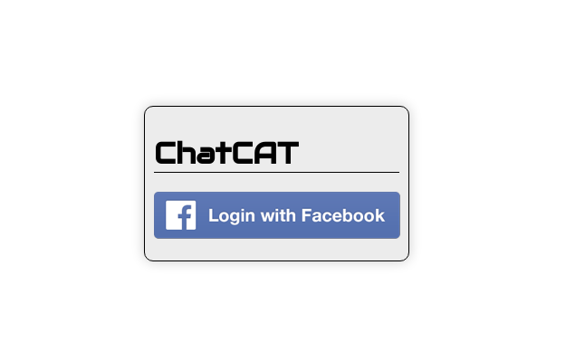

# chat-cat
 
## Goals 
- Creating a Realtime Multiroom Chat App 
- Deploying it on Heroku Learning Objective Build a Realtime Multiroom Chat Server
- Deploy it on Heroku's Platform-As-A-Service. 
- Gain valuable insight into several other NodeJS features and app structure strategies

## Description
- Lets you log-in with Facebook account. No sign-up
- Lets you create topic specific chatrooms.
- Lets you joint multiple chatrooms.
- I intentionally avoided using bootstrap

## index.html
beggining of the app: for log-in with facebook, the app take you to facebook for authorization, and once you are done with authorization then it will re-direct back to the chatroom page.

## chatroom page
It simply has the list of rooms available. You can click on the rooms' name to start in the chat window.You are also able to create your own chatroom.
This page also includes you facebook name and photo.

## room.html 
It looks something like this. One the right hand side you have the list of active users. You have a window that shows the messages that piling up. and a text area that you can enter your message and send it.

